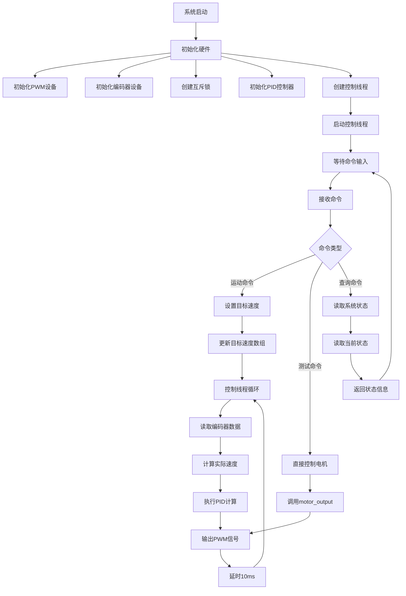
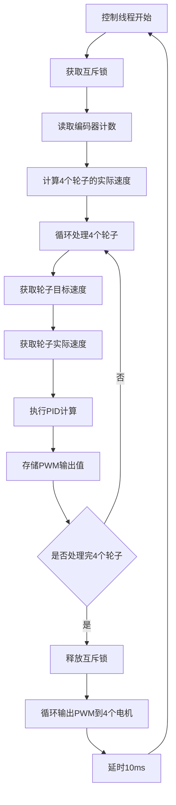
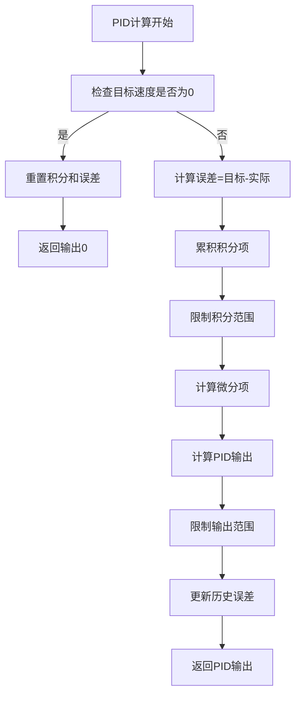
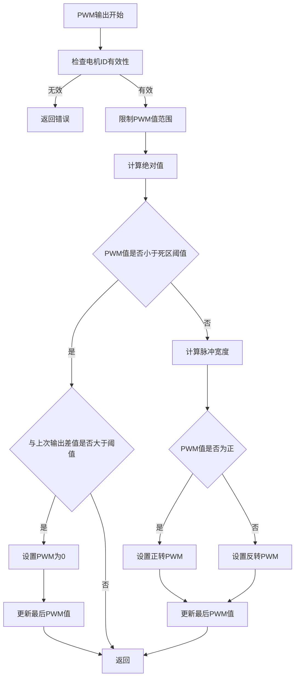
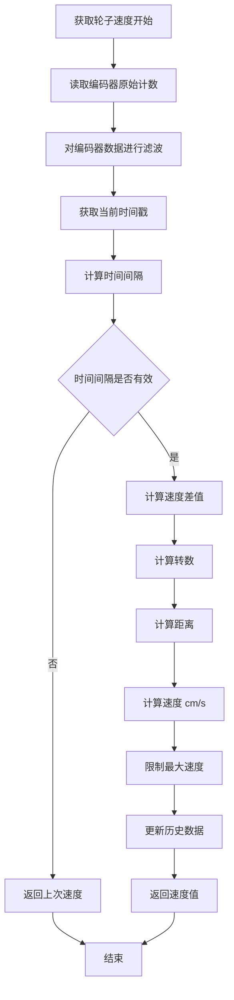
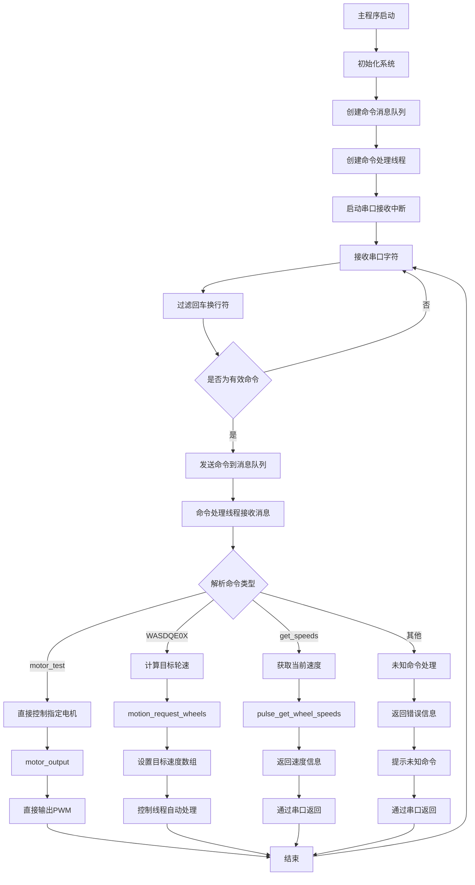
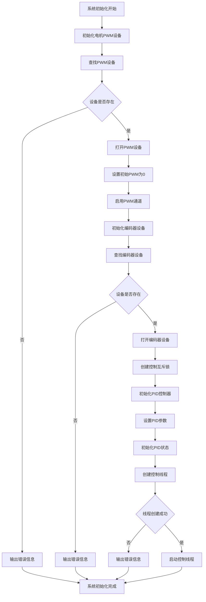

# 麦克纳姆轮机器人控制系统流程图

## 1. 系统总体架构流程图

```mermaid
graph TD
    A[系统启动] --> B[初始化硬件]
    B --> C[初始化PWM设备]
    B --> D[初始化编码器设备]
    B --> E[创建互斥锁]
    B --> F[初始化PID控制器]
    B --> G[创建控制线程]
    G --> H[启动控制线程]
    H --> I[等待命令输入]
    
    I --> J[接收命令]
    J --> K{命令类型}
    K -->|运动命令| L[设置目标速度]
    K -->|测试命令| M[直接控制电机]
    K -->|查询命令| N[读取系统状态]
    
    L --> O[更新目标速度数组]
    O --> P[控制线程循环]
    
    P --> Q[读取编码器数据]
    Q --> R[计算实际速度]
    R --> S[执行PID计算]
    S --> T[输出PWM信号]
    T --> U[延时10ms]
    U --> P
    
    M --> V[调用motor_output]
    V --> T
    
    N --> W[读取当前状态]
    W --> X[返回状态信息]
    X --> I
```

## 2. 控制线程详细流程图

```mermaid
graph TD
    A[控制线程开始] --> B[获取互斥锁]
    B --> C[读取编码器计数]
    C --> D[计算4个轮子的实际速度]
    D --> E[循环处理4个轮子]
    
    E --> F[获取轮子目标速度]
    F --> G[获取轮子实际速度]
    G --> H[执行PID计算]
    H --> I[存储PWM输出值]
    I --> J{是否处理完4个轮子}
    J -->|否| E
    J -->|是| K[释放互斥锁]
    
    K --> L[循环输出PWM到4个电机]
    L --> M[延时10ms]
    M --> A
```

## 3. PID计算流程图

```mermaid
graph TD
    A[PID计算开始] --> B[检查目标速度是否为0]
    B -->|是| C[重置积分和误差]
    B -->|否| D[计算误差=目标-实际]
    C --> E[返回输出0]
    D --> F[累积积分项]
    F --> G[限制积分范围]
    G --> H[计算微分项]
    H --> I[计算PID输出]
    I --> J[限制输出范围]
    J --> K[更新历史误差]
    K --> L[返回PID输出]
```

## 4. PWM输出流程图

```mermaid
graph TD
    A[PWM输出开始] --> B[检查电机ID有效性]
    B -->|无效| C[返回错误]
    B -->|有效| D[限制PWM值范围]
    D --> E[计算绝对值]
    E --> F{PWM值是否小于死区阈值}
    F -->|是| G{与上次输出差值是否大于阈值}
    F -->|否| H[计算脉冲宽度]
    G -->|是| I[设置PWM为0]
    G -->|否| J[返回]
    H --> K{PWM值是否为正}
    K -->|是| L[设置正转PWM]
    K -->|否| M[设置反转PWM]
    L --> N[更新最后PWM值]
    M --> N
    I --> O[更新最后PWM值]
    N --> J
    O --> J
```

## 5. 编码器速度计算流程图

```mermaid
graph TD
    A[获取轮子速度开始] --> B[读取编码器原始计数]
    B --> C[对编码器数据进行滤波]
    C --> D[获取当前时间戳]
    D --> E[计算时间间隔]
    E --> F{时间间隔是否有效}
    F -->|否| G[返回上次速度]
    F -->|是| H[计算速度差值]
    H --> I[计算转数]
    I --> J[计算距离]
    J --> K[计算速度 cm/s]
    K --> L[限制最大速度]
    L --> M[更新历史数据]
    M --> N[返回速度值]
    G --> O[结束]
    N --> O
```

## 6. 命令处理流程图

```mermaid
graph TD
    A[主程序启动] --> B[初始化系统]
    B --> C[创建命令消息队列]
    C --> D[创建命令处理线程]
    D --> E[启动串口接收中断]
    
    E --> F[接收串口字符]
    F --> G[过滤回车换行符]
    G --> H{是否为有效命令}
    H -->|是| I[发送命令到消息队列]
    H -->|否| F
    
    I --> J[命令处理线程接收消息]
    J --> K{解析命令类型}
    K -->|WASDQE0X| L[计算目标轮速]
    K -->|motor_test| M[直接控制指定电机]
    K -->|get_speeds| N[获取当前速度]
    K -->|其他| O[未知命令处理]
    
    L --> P[motion_request_wheels]
    M --> Q[motor_output]
    N --> R[pulse_get_wheel_speeds]
    O --> S[返回错误信息]
    
    P --> T[设置目标速度数组]
    Q --> U[直接输出PWM]
    R --> V[返回速度信息]
    S --> W[提示未知命令]
    
    T --> X[控制线程自动处理]
    U --> Y[结束]
    V --> Z[通过串口返回]
    W --> AA[通过串口返回]
    X --> Y
    Z --> Y
    AA --> Y
    Y --> F
```

## 7. 系统初始化流程图

```mermaid
graph TD
    A[系统初始化开始] --> B[初始化电机PWM设备]
    B --> C[查找PWM设备]
    C --> D{设备是否存在}
    D -->|否| E[输出错误信息]
    D -->|是| F[打开PWM设备]
    F --> G[设置初始PWM为0]
    G --> H[启用PWM通道]
    
    H --> I[初始化编码器设备]
    I --> J[查找编码器设备]
    J --> K{设备是否存在}
    K -->|否| L[输出错误信息]
    K -->|是| M[打开编码器设备]
    
    M --> N[创建控制互斥锁]
    N --> O[初始化PID控制器]
    O --> P[设置PID参数]
    P --> Q[初始化PID状态]
    
    Q --> R[创建控制线程]
    R --> S{线程创建成功}
    S -->|否| T[输出错误信息]
    S -->|是| U[启动控制线程]
    
    U --> V[系统初始化完成]
    E --> V
    L --> V
    T --> V
```